# Artistic Practice is a Form of Research
Fall, 2025

---

This lecture is concerned with art research methods, or how research takes place through and in artistic practices. How can art practices can be understood as research? Where does the research happen in art practice? We will focus mostly on media art practices that live at that blurry intersection of art, design and technology. 

We will look at:  
- giving language to art as research
- artistic strategies 
- research methods used by artists
- approaches in media arts and related practices

## Getting Orientated

Unlike science, there is no “one way” of doing art (or design). 

But there are defined research methods that artists use in their process as well as an extenisive, albeit loose taxonomy of strategies artists deploy in their practices to provoke thinking, converation and new perpectives. As we look at work today, ask yourself what research processes might the artist have undertaken to produce the work? And, what artistic strategies are at play in the final outcomes (immersion, humor, estrangement, juxtaposition etc etc)?

We will also consider some of the scholarly literature and language around art as research.

To start, consider how computer artist Zach Lieberman, one of the founders of the School for Poetic Computation, describes his practice of poetic computing:

So when we talk about art as research, I am not talking about quantitative work, or art making that has produced "solutions" to problems. I am not talking about art as being a demo of new technologies. Yes this is what research often looks like in science, engineering and often design, but in art, the process and work itself embodies the research. So the research is embedded or emerges through a story, a poem, an experience, an aesthetic, a suprising outcome, an enchanting or strange object or image etc. 

At times, the outcome might be appear fairly minimal (a drawing or sculpture), but art is the result of an enormous backend that consists of an engagement with history, with conversations happening in theory and the field of practice you are working in. It is also born of a rigorous relationship between practice and reflection. 

Zach argues this in his essay "[Lessons for Students](https://zachlieberman.medium.com/lessons-for-students-cf1acf200ee#.cee1uz3mx)". 

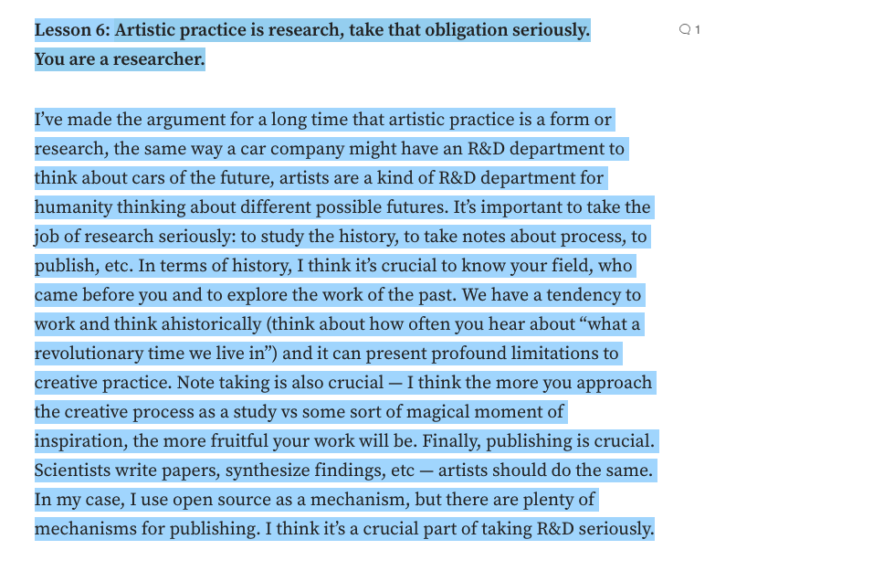

See Zach's [portfolio here](http://zach.li/).

We will return to some of these ideas again later, but what is key here is the emphasis on art making as a form of study, as well as requiring publishing or dissemination. 

## Giving language to artistic research 

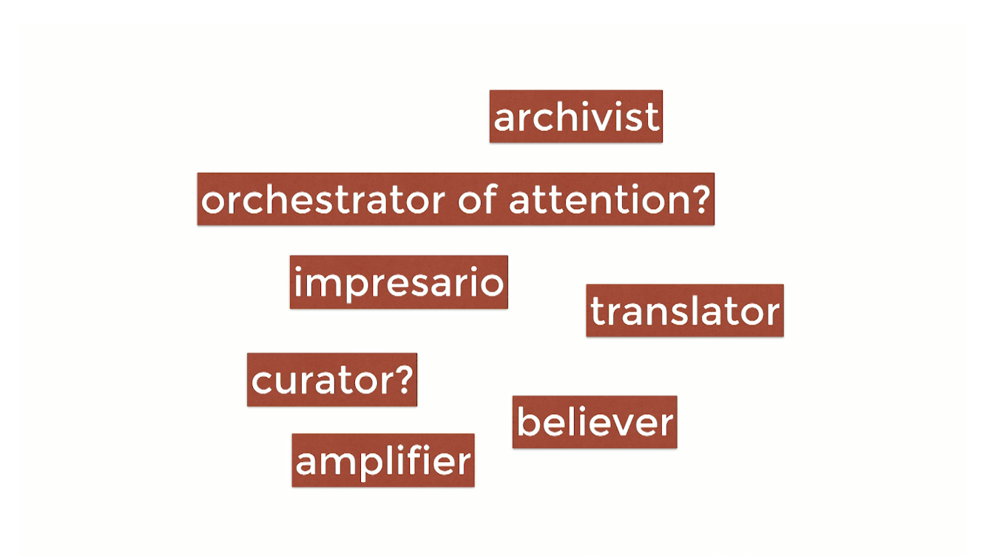

This is a slide from Sarah Hendren's must-watch Eyeo talk, ["Know-Nothings, Dilettantes, and Melancholy Interlopers"](https://vimeo.com/179040817?fl=pl&fe=vl) where she calls for new language that legitimizes different pathways into meaningful creative practice. 

As you might infer from this beginning, there isn't one way to describe art as research, but let's take a look at a few approaches from the literature. Note that these terms do not describe exclusive categories and many works operate as research in multiple ways.

### Practice Led vs Practice Based

My definitions below are taken from Dr Linda Candy and Ernest Edmonds from UTS in Sydney who have [written extensively on different practice research methods.](https://www.creativityandcognition.com/practice-based-research/)

#### Practice-Led 

Research is practice-led if it “leads primarily to new understandings about the nature of practice”. 
Practice-led work innovates new methods, for example, it might combine approaches from different disciplines. It produces new approaches on what art making is and what it looks like and the insights are typically articulated through both the artwork AND reflective/theoretical outputs (papers, talks, documentation). Consider:

Morehshin Allahyari's [Material Speculation: ISIS  (2015-2016).](https://morehshin.com/material-speculation-isis) 

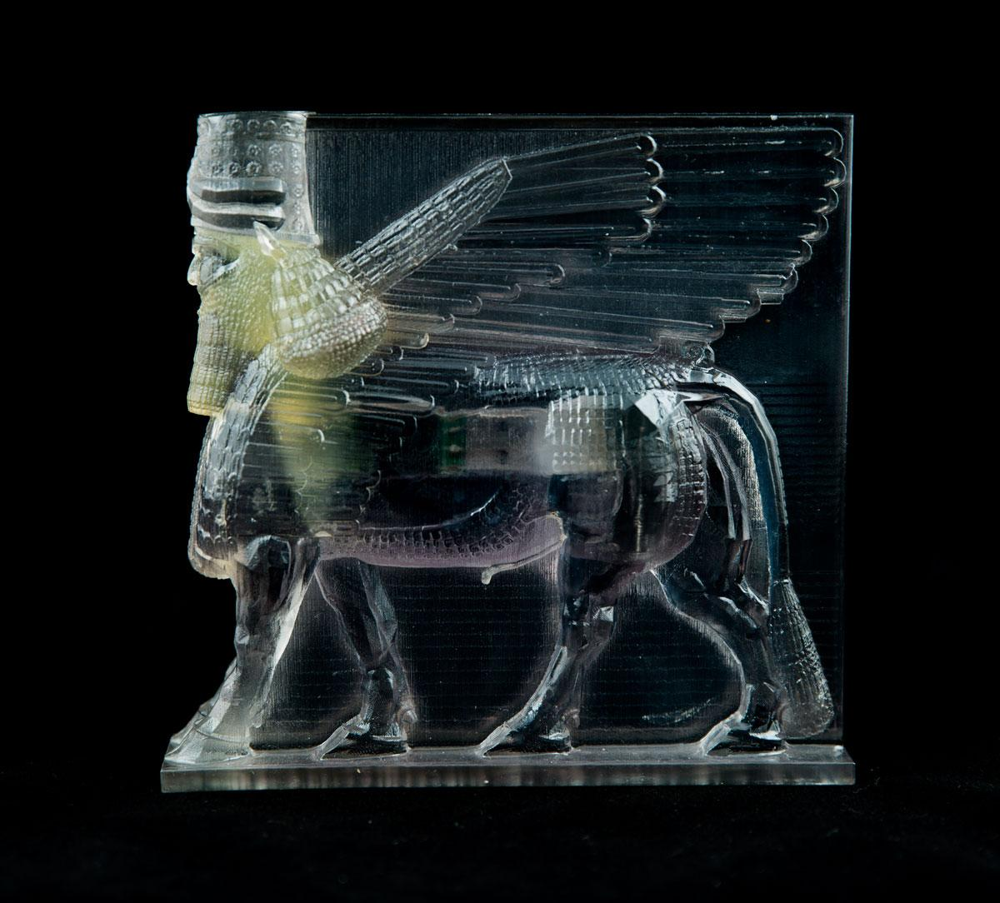

Emerges alongside her work on [*Additivism*](https://additivism.org/) which explores the activist potential of the democratization of 3d fabrication technologies.

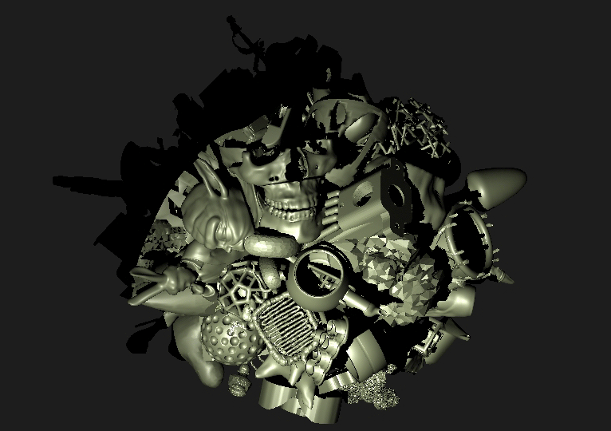

*Critical Engineering* [(see the manifesto)](https://criticalengineering.org/) are tech based practices that use "the exploit" as a method, so publically identifying a risk, weakness, a contradiction, or way in which a technology exploits its user. CE then makes this public in some way (through a work, a performance, an experience.)

Julian Oliver's [Glasshole](https://julianoliver.com/projects/glasshole/) clearly does this. 

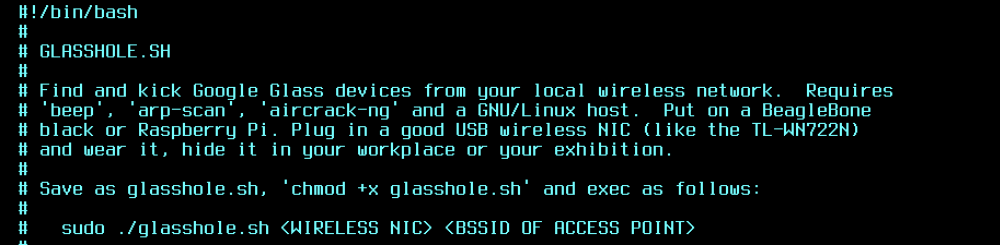 

And Aaram Barthroll's [How to Build a Fake Google Street View Car](https://arambartholl.com/how-to-build-a-fake-google-street-view-car/) is one of my all time favorite exploits.

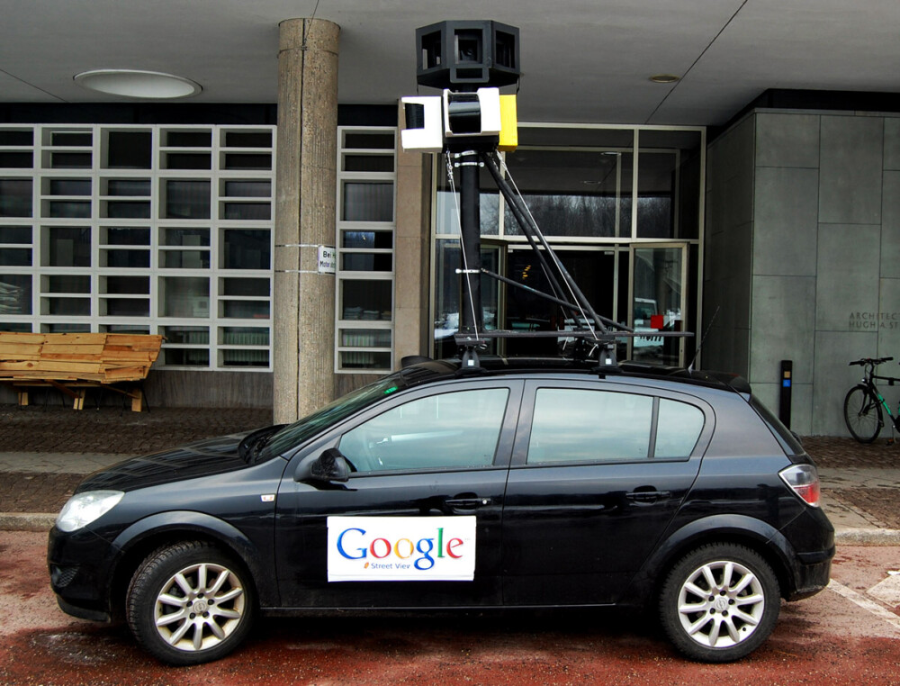 

My work like [Being Radiotropic](https://tegabrain.com/Being-Radiotropic),and [ Solar Protocol](https://tegabrain.com/Solar-Protocol). These emerge through cycles of practice and writing around what I call [*eccentric engineering*](https://tegabrain.com/Eccentric-Engineering). This is an approach I developed for my PhD thesis which focuses on using art as a space for designing digital technologies that work in concert with environments. 

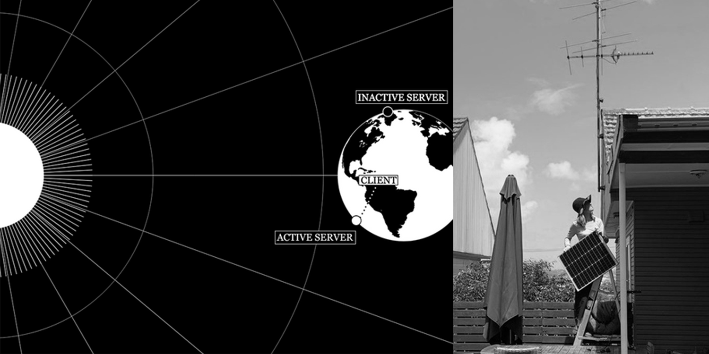 

#### Practice Based

Practice that adopts existing ways of working to produce new outcomes – “If the creative artifact is the basis of the contribution to knowledge, the research is practice-based”. These works tend to use existing methods to produce new original works of designs, music, digital media, performances and exhibitions. The work itself constitutes the research into what's possible—without necessarily producing separate theoretical papers about the findings.

Saskia Freeke. [Daily generative art.](https://www.instagram.com/sasj_nl) 2010–2020. Generative image series. 

 

American Artist, [Black Gooey Universe.
](https://americanartist.us/works/black-gooey-universe)

 

Casey Reas, [Generative practice.
](https://reas.com/atomism)

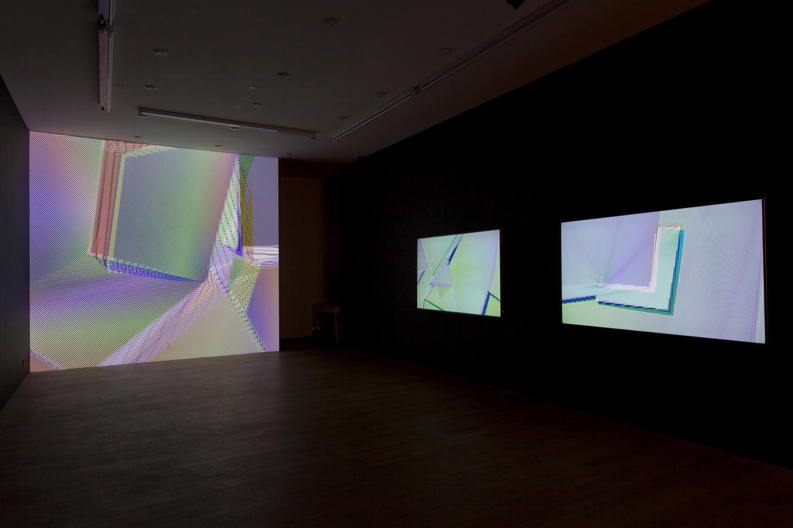 

Rafael Lorenzo-Hemmer, interactive works like [Pulse Room](https://www.lozano-hemmer.com/pulse_room.php) etc. 

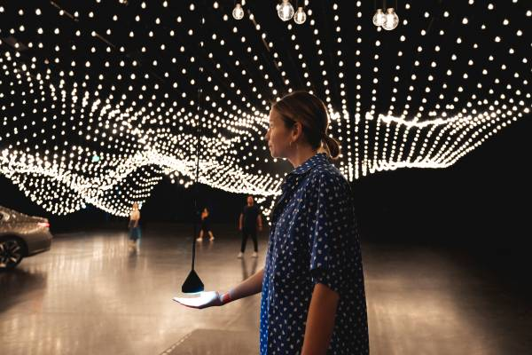 

### Another way: Research *into*, *through* or *for* Art

In his a well known article called ["Research in Art and Design"](https://antle.iat.sfu.ca/wp-content/uploads/2018/08/Frayling.pdf), cultural historian and educationalist Christopher Frayling (1993), differentiates between research *into* art, research *through* art and research *for* art.

#### Research ***into*** art

- Historical Research
- Aesthetic or Perceptual Research
- Research into a variety of theoretical perspectives on art and design - social, economic, political, ethical, cultural, iconographic, technical, material, structural....whatever.

For example. Alan Warburton's richly researched films about the history of computational moving image making, [RGBFAQ (2020)](https://alanwarburton.co.uk/thewizardofai). RGBFAQ traces the trajectory of computer graphics from WW2 to Bell Labs in the 1960s, from the visual effects studios of the 1990s to the GPU-assisted algorithms of the latest machine learning models and the emergence of the synthetic datasets.

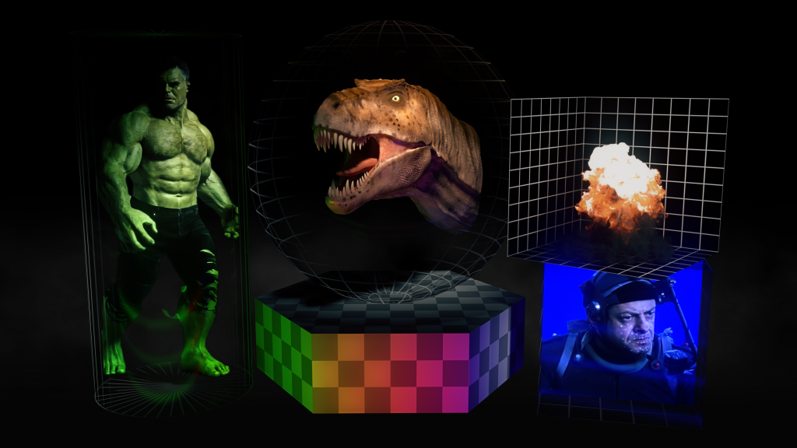

Gabriella Hirst's work [Darling Darling.
](https://www.gabriellahirst.com/Darling-Darling**) also engages with colonial Australian art history as she juxtaposes a video of the painstaking restoration of a colonial painting with another video of the current degraded state of the river represented in the work.  

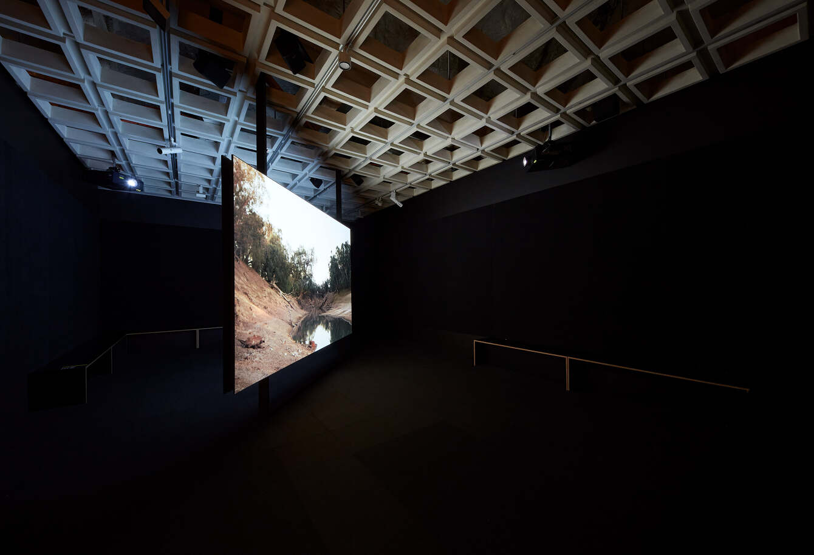

#### Research ***through*** art 

- materials research
- development research (new software or tools)
- action research - where a research diary tells,
in a step-by-step way, of a practical experiment in the studio.

Licia He, [Plotter Paintings. ](https://www.eyesofpanda.com/)

Examples include Beatrice de Costa's [Pigeonblog
](https://nideffer.net/shaniweb/pigeonblog.php)

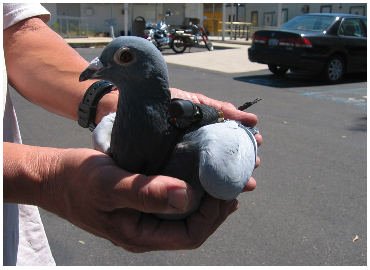

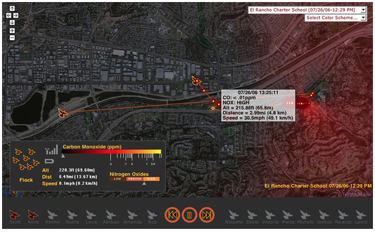

Thomas Thwaites, [Toaster Project. 
](https://www.thomasthwaites.com/the-toaster-project/)

 
Kate Crawford + Trevor Paglan's [ImageNet Roulette](https://paglen.studio/2020/04/29/imagenet-roulette/). This interface acts as a portal through which we see the technology of ML differently. 
[Also see other works by both these artists for more examples.]

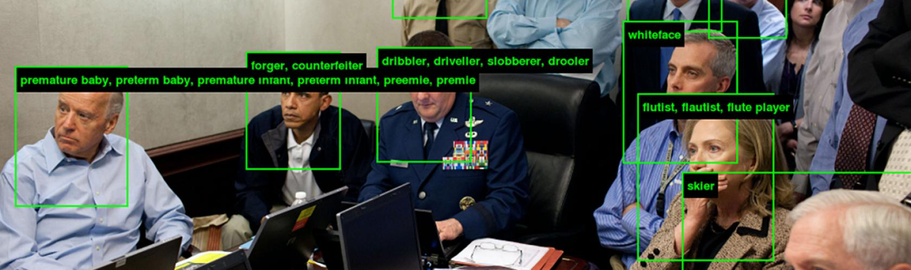

#### Research ***for*** art 

Research for art is research where the end product is an artefact - where the thinking is embodied in the artefact, where the goal is not primarily communicable knowledge in the sense of verbal communication, but in the sense of visual or iconic or imagistic communication.

Alexandra Daisy Ginsberg, [Pollinator Pathway](https://www.daisyginsberg.com/work/pollinator-pathmaker)

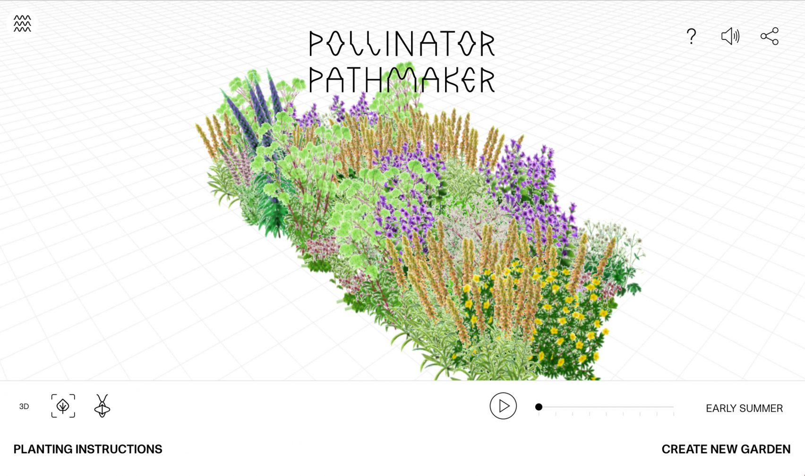
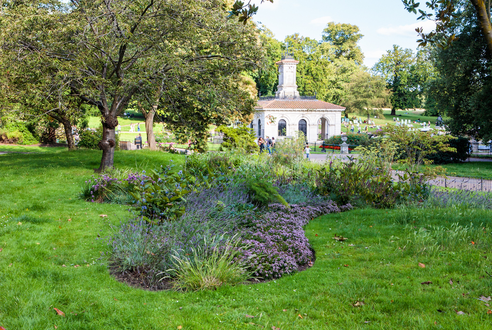

Heather Dewey Hagborg, [Stranger Visions ](https://deweyhagborg.com/projects/stranger-visions)

Thomas Saranceno, [Hybrid Webs](https://studiotomassaraceno.org/hybrid-webs/)

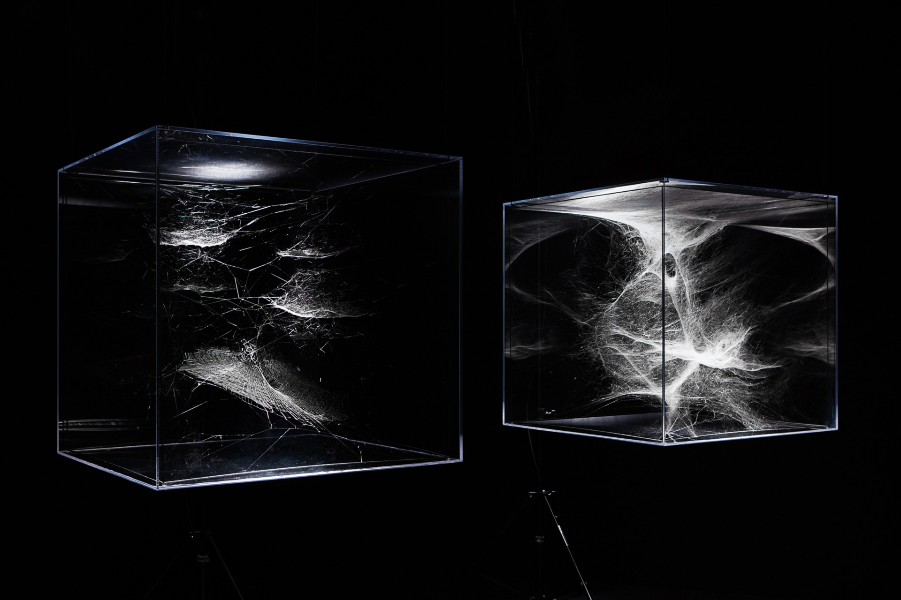

*But all these works also straddle the previous category too... and as Alexandra Daisy Ginsberg writes.. that's ok, many works sit under more than one header. In other words...*

Alexandra Daisy Ginsberg observes this in her 2018 Phd thesis on biodesign:

>My work encompasses all three *(approaches)*, as research and practice merge: my critical design practice informs the thesis and vice versa. My interventions in synthetic biology and its politics—reflecting the subject’s live nature—developed my thinking and practice, and helped me to identify synthetic biology’s proliferating meanings of better.

> Leading with practice allowed me to reflect on it afterwards, but design and theory are not separate: writing is practice too. My design projects demanded literature reviews of their own; their public exhibition, dissemination, and discussion informed my analysis and directed further reading across different disciplines, which instigated new action. Further research led me to classify the dream of better as a sociotechnical imaginary, to use its framework to structure my research into examining better, and to review critical design and biodesign in this context.This process deepened my understanding of each project, of critical design and, ultimately, of better.”
	
### Cycles of Practice and Reflection 	
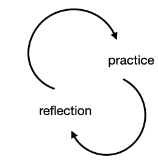

Ginsberg talks about cycles in her research between practice and reflection, or making and thinking which is articulated in a lot of thinking on art methods. An artist moves from one project, to a period of reflection and writing, and then that thinking goes into the next work. This is a methodolgical approach called "reflection-in-action" and was described by Donald Schon in his 1986 book called[ *The Reflective Practicioner*](https://www.tandfonline.com/doi/abs/10.1080/07377366.1986.10401080) (p. 130). It refers to a system structured by cycles of practice and reflection, where both the successes and problems encountered through each artwork have been reflected upon, placed into dialogue with relevant theory and then fed into the direction of the apposite project. Schon (1986) describes this as spiralling through “stages of appreciation, action and reappreciation” (p. 131). 

### Artistic Strategies: Giving language to what the work is doing...

When you are looking at the work of artists and designers, think about the strategies they are using in their work. What is the work/artist doing? Is the artist estranging, juxtaposing, speculating? 

Giving language to practice and to the strategies being used is a crucial for art as researh. 

Here is an incomplete and non-exhaustive list of artistic strategies that we've seen used in the work we've looked at so far:

- Visualizing, making visible (data, process, supply chains, [Anatomy of AI](https://anatomyof.ai/)) 
- Interactivity
- Storytelling / speculative fiction
- Intervention
- Performance (durational, lecture, etc)
- Embodiment
- Participation
- Re-enactment
- Humor
- Toolmaking, eg. software, browser entensions, kits
- Experimental publishing/cataloguing eg. “[The field guide](https://placesjournal.org/article/cloud-and-field/)”
- Workshops
- Curating
- Reverse engineering
- Re-engineering 
- Attending to histories of tech, materials, art as practice
- Site specificity
- Data collection
- Web scraping
- Inversion (the gaze, surveillance etc)
- De-automation

To look at an example, let's consider the strategies in [Lauren](https://get-lauren.net/SOMEONE) by Lauren Lee Mccarthy. A series of work where the audience becomes a human Alexa. Custom smart devices — cameras, mics, locks, faucets, appliancesinstalled are installed into the homes of volunteers and controlled by actual people rather than data-driven systems. 

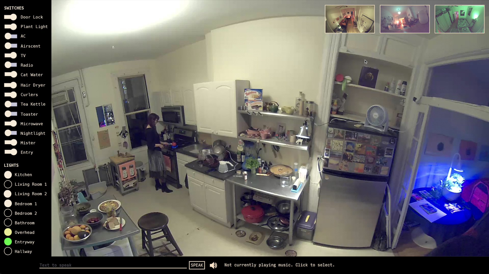

What strategies are at play in this work? 

## Research Methods Used by Artists

What does an artist do to work out what to make? Or how do they figure out what their project will be. Designer Sarah Hendron also speaks to this when she prompts students "Who is in your personal canon?". 

- Literature review 
- Practice review
- Interviews
- Workshops
- Experiments in practice (material testing, learning to make media with a new app or writing software or materials experimentation).

- For example, [Synthetic Messenger](https://tegabrain.com/Synthetic-Messenger)

Undertaking these kinds of activities are crucial for you to create work that has traction, that contributes to a "grand conversation". 

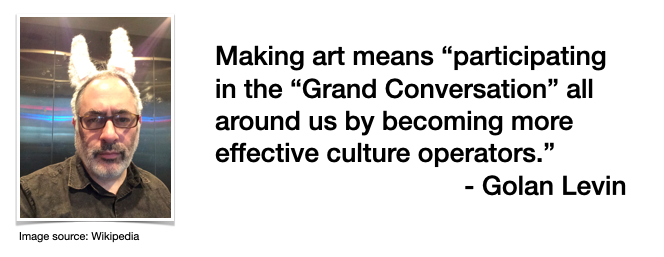

To participate in these conversations that run through fields often over decades, two things are *essential*: a deep awareness of your field of practice and the public dissemination of your work. 

### Lets see this in action: 

#### Golan Levin
[Manual Input Work Station 2004.
](https://www.flong.com/archive/projects/miw/index.html).

Accompanied by [An Informal Catalogue of New-Media Performances Using Overhead Projectors (OHPs). ](https://www.flong.com/archive/texts/lists/ohp/index.html)

Similarly, his [Index of Slit Scanning History](https://www.flong.com/archive/texts/lists/slit_scan/index.html ), shows a deep engagement with a common creative coding technique that continues a conversation that spans the history of image making with cameras. 

#### Kyle McDonald
Kyle McDonald, [People Staring at Computers](https://kylemcdonald.net/psac/). [Video.
](https://vimeo.com/25958231)

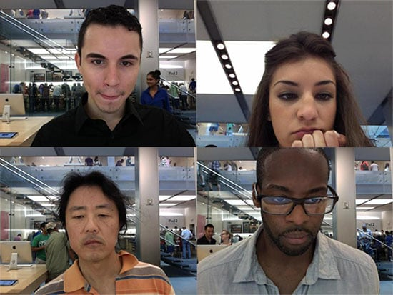

McDonald's grasp and positioning of his work in conversation with the field of facial recognition is made clear in his essay, [Working with Faces.   
](https://kcimc.medium.com/working-with-faces-e63a86391a93 )

#### Mimi Onouha
Mimi Onouha's [Library of Missing Datasets](https://mimionuoha.com/the-library-of-missing-datasets) is also a work that is emergent around a conversation happing in theory and research around data collection, surveillance and representation in datasets. Speaking about face reconigoion, this is what Ruha Benjamin calls the "double bind" where groups who are underrepresented in a dataset are subject to injustices like misrecognition, but subject to opression or overpolicing if this gets corrected. [Read her on this here.](https://github.com/MimiOnuoha/missing-datasets)

 

[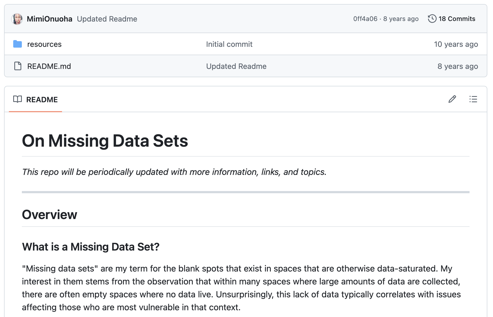 ](https://github.com/MimiOnuoha/missing-datasets)

What strategies are at play in Levin, McDonald, Onouha's work?

## Approaches/research framings in Art and Tech 

Framing for different approachs to art research:

- Tactical Media: http://www.tacticalmediafiles.net/articles/44999 
- Critical Design: https://dunneandraby.co.uk/content/bydandr/13 
- Speculative design: https://mitpress.mit.edu/9780262019842/speculative-everything/ 
- Social practice art: https://www.artforum.com/features/the-social-turn-collaboration-and-its-discontents-173361/ 
- The Public Amateur - [A framing](https://publicamateur.wordpress.com/2009/01/18/beyond-face/#more-34) decveloped by artist Claire Pentacosts for artists working on the edge of another field as a non-expert. See Sarah Hendren's [post](https://sarahendren.com/abler-archive/2011-03-24-the-public-amateur/) or [talk here](https://sarahendren.com/projects-lab/design-for-know-nothings-dilettantes-and-melancholy-interlopers-eyeo-2016/).
- Poetic Computation - “poems not demos”, School for Poetic Computation
- Critical Engineering: https://criticalengineering.org/ 
- Eccentric Engineering - https://tegabrain.com/Eccentric-Engineering 
- Additivism - additivism.org
- Scrapism: https://scrapism.lav.io/ 

## Further Resources and Reading

- Sara Hendren, [Design for Know-Nothings, Dilettantes, and Melancholy Interlopers](https://sarahendren.com/projects-lab/design-for-know-nothings-dilettantes-and-melancholy-interlopers-eyeo-2016/), Eyeo Talk 2016
- [Making and Being](https://makingandbeing.com/) by Susan Jahoda and Caroline Woolard.
- [This is a talk by Larry McEnerney ](https://www.youtube.com/watch?v=vtIzMaLkCaM)for PhDs on writing from U Chicago, but valuable for understanding how academia operates and what writing is for in this context.
- [Critical Experiences](https://criticalexperiences.itp.io/) class website (ITP).

