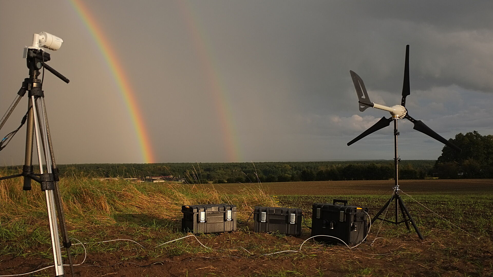

# Artistic Practice is a Form of Research
Fall, 2025

---

This lecture is concerned with how research takes place in and through artistic practices. We will focus mostly on media art practices and those at the blurry intersection between art and design and technology. This is a two pronged endevour, I'm interested in where the research happens in art practice *and* how art pratices can be understood as research. 

We will look at: 

- giving language to art as research
- research methods artists use
- artistic strategies / methods
- approaches in media arts and related practices

## Getting Orientated

Unlike science, there is no “one way” of doing art (or design). 

But there are defined research methods that artists use in their process as well as an extenisive, albeit loose taxonomy of strategies artists deploy in their practices to produce new thinking and new knowledge (aka research). As we look at the examples in this lecture, ask yourself what research processes has the artist undertaken to produce the work, and what artistic strategies are being used (immersion, humor, estrangement, juxtaposition etc etc) to produce new thinking or experiences.

We will also touch on some of the scholarly literature and language around art as research.

To start, I like how computer artist Zach Lieberman, one of the founders of the School for Poetic Computation, describes poetic computing:

So when I am talking about research, I am not talking about quantitative work, or "solutions" to problems or demos of new technologies. Yes this is what research looks like in science, engineering and often design, but in art, the work or the process is the research. So it often takes the form of creating a poem, an experience, an aesthetic, a suprise, telling a story, or creating enchantment or estrangement around something seemingly ordinary. Even though the outcome might be appear simple or minimal, art as research requires an enormous backend, that consists of an engagement with history, an awareness of conversations in theory, and a rigorous relationship between practice and reflection. 

Zach also argues this in his essay "[Lessons for Students](https://zachlieberman.medium.com/lessons-for-students-cf1acf200ee#.cee1uz3mx)". 

See Zach's [portfolio](http://zach.li/) and practice of [daily sketching](https://www.instagram.com/zach.lieberman/).

## Giving a language to artistic research

### Practice Led vs Practice Based

My definitions below are taken from Dr Linda Candy and Ernest Edmonds from UTS in Sydney who have [written extensively on different practice research methods.](https://www.creativityandcognition.com/practice-based-research/)

####Practice-Led 
Research is practice-led if it “leads primarily to new understandings about the nature of practice”. 
Practice-led work innovates new methods, for example, it might combine approaches from different disciplines. It produces new approaches on what art making is and what it looks like and the insights are typically articulated through both the artwork AND reflective/theoretical outputs (papers, talks, documentation)

- Additivism. [Website](https://additivism.org/)

	- Morehshin Allahyari, [Material Speculation: ISIS  (2015-2016).](https://morehshin.com/material-speculation-isis) 

- Critical Engineering. [Website](https://criticalengineering.org/)
  - Julian Oliver, [Glasshole](https://julianoliver.com/projects/glasshole/), [Harvest](https://julianoliver.com/projects/harvest/)

  - Aaram Barthroll, [How to Build a Fake Google Street View Car](https://arambartholl.com/how-to-build-a-fake-google-street-view-car/).

- Eccentric Engineering. [Website](https://tegabrain.com/Eccentric-Engineering)
	- Tega Brain, [Being Radiotropic](https://tegabrain.com/Being-Radiotropic),[ Solar Protocol](https://tegabrain.com/Solar-Protocol) 
- Mimi Onouha, [Library of Missing Datasets](https://mimionuoha.com/the-library-of-missing-datasets).

####Practice Based
Practice that adopts existing ways of working to produce new outcomes – “If the creative artifact is the basis of the contribution to knowledge, the research is practice-based”. These works tend to use existing methods to produce new original works of designs, music, digital media, performances and exhibitions. The work itself constitutes the research into what's possible—without necessarily producing separate theoretical papers about the findings.

-  Zach Lieberman - [Daily Sketches](https://www.instagram.com/zach.lieberman/?hl=en). 
- American Artist, [Black Gooey Universe.
](https://americanartist.us/works/black-gooey-universe)
- Casey Reas, [Generative practice.
](https://reas.com/atomism)
- Rafael Lorenzo-Hemmer, interactive works like [Pulse Room](https://www.lozano-hemmer.com/pulse_room.php) etc. 

###Another way: Research *into*, *through* or *for* Art

In his research paper called ["Research in Art and Design"](https://antle.iat.sfu.ca/wp-content/uploads/2018/08/Frayling.pdf), cultural historian and educationalist Christopher Frayling (1993), differentiates between:

- Research ***into*** art (like the work of the historian, what have artists done and how)
	- Alan Warburton, various, [Wizard of AI](https://alanwarburton.co.uk/thewizardofai)
	- Gabriella Hirst, [Darling Darling.
](https://www.gabriellahirst.com/Darling-Darling**)
- Research ***through*** art (using art as a way of investigating, engaging with issues, creating new perspectives)
	- Beatrice de Costa, [Pigeonblog
](https://nideffer.net/shaniweb/pigeonblog.php) 
	- Kate Crawford + Trevor Paglan, [ImagenetRoulette](https://paglen.studio/2020/04/29/imagenet-roulette/)
	- Tega Brain + Sam Lavigne, [enron.email
](https://enron.email/)
 	- Trevor Paglan, [They took the faces](https://paglen.studio/2020/04/09/they-took-the-faces-from-the-accused-and-the-dead/)
- Research ***for*** art (thinking is embodied in the artefact, where medium is innovated, tool making)
	- Golan Levin 
	- Thomas Saranceno
	- Heather Dewey Hagborg 
	- *but all these works also straddle the previous category too... and as Alexandra Daisy Ginsberg writes.. that's ok!*

In her 2018 Phd thesis on biodesign, Alexandra Daisy Ginsbery writes:

>My work encompasses all three, as research and practice merge: my critical design practice informs the thesis and vice versa. My interventions in synthetic biology and its politics—reflecting the subject’s live nature—developed my thinking and practice, and helped me to identify synthetic biology’s proliferating meanings of better.

> Leading with practice allowed me to reflect on it afterwards, but design and theory are not separate: writing is practice too. My design projects demanded literature reviews of their own; their public exhibition, dissemination, and discussion informed my analysis and directed further reading across different disciplines, which instigated new action. Further research led me to classify the dream of better as a sociotechnical imaginary, to use its framework to structure my research into examining better, and to review critical design and biodesign in this context.This process deepened my understanding of each project, of critical design and, ultimately, of better.”
	
### Cycles of Practice and Reflection 	

Ginsberg talks about cycles in her research between practice and reflection, or making and thinking which is articulated in a lot of thinking on art methods. An artist moves from one project, to a period of reflection and writing, and then that thinking goes into the next work. This is a methodolgical approach called "reflection-in-action" and was described by Donald Schon in his 1986 book called[ *The Reflective Practicioner*](https://www.tandfonline.com/doi/abs/10.1080/07377366.1986.10401080) (p. 130). It refers to a system structured by cycles of practice and reflection, where both the successes and problems encountered through each artwork have been reflected upon, placed into dialogue with relevant theory and then fed into the direction of the apposite project. Schon (1986) describes this as spiralling through “stages of appreciation, action and reappreciation” (p. 131). 

## Research Methods Used by Artists

What does an artist do to work out what to make? Or how do they figure out what their project will be?

- Literature review 
- Practice review
- Interviews
- Workshops
- Experiments in practice (material testing, learning to make media with a new app or writing software or materials experimentation) 
- Production
- Public exhibition / Publication / Dissemination

To participate in this conversation that often spans decades, an deep awareness of your field of practice and a public dissemination of your work is *essential*. 

Designer Sarah Hendron speaks to this when she asks her students "Who is in your personal canon?"

### Lets see this in action: 

#### Golan Levin
- [Manual Input Work Station.
](https://www.flong.com/archive/projects/miw/index.html)
- Accompanied by [An Informal Catalogue of New-Media Performances Using Overhead Projectors (OHPs). ](https://www.flong.com/archive/texts/lists/ohp/index.html)
Similarly, his [Index of Slit Scanning History](https://www.flong.com/archive/texts/lists/slit_scan/index.html ), shows a deep engagement with a common creative coding technique that continues a conversation that spans the history of image making with cameras. 

#### Kyle McDonald
- Kyle McDonald, People Staring at Computers
https://vimeo.com/25958231 
- Kyle McDonald, https://kylemcdonald.net/psac/ 
- Working with Faces: https://kcimc.medium.com/working-with-faces-e63a86391a93 

## Artistic Methods/Strategies

Here is an incomplete and non-exhaustive list of artistic strategies:

- Visualization (data, process, supply chains) 
- Interactivity
- Storytelling / speculative fiction
- Intervention
- Performance 
- Participation
- Re-enactment
- Humor
- Toolmaking, eg. software, browser entensions, kits
- Publishing eg. “The field guide”
- Workshops as art
- Curating
- Reverse engineering
- Re-engineering 
- Histories of tech, materials, art as practice
- Site specificity
- Data collection
- Web scraping

What strategies are Levin and McDonald using in their respective works? 

## Approaches in Art and Tech 

Approaches or areas of work:

- Tactical Media: http://www.tacticalmediafiles.net/articles/44999 
- Critical Design: https://dunneandraby.co.uk/content/bydandr/13 
- Speculative design: https://mitpress.mit.edu/9780262019842/speculative-everything/ 
- Social practice art: https://www.artforum.com/features/the-social-turn-collaboration-and-its-discontents-173361/ 
- The Public Amateur: https://sarahendren.com/abler-archive/2011-03-24-the-public-amateur/ 
- Poetic Computation - “poems not demos”, School for Poetic Computation
- Critical Engineering: https://criticalengineering.org/ 
- Eccentric Engineering
- Additivism - additivism.org
- Scrapism: https://scrapism.lav.io/ 

## Further Resources and Reading
- Sara Hendren, [Design for Know-Nothings, Dilettantes, and Melancholy Interlopers](https://sarahendren.com/projects-lab/design-for-know-nothings-dilettantes-and-melancholy-interlopers-eyeo-2016/), Eyeo Talk 2016
- Making and Being. 
- https://criticalexperiences.itp.io/ 
- Emergent Strategy

